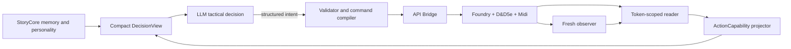
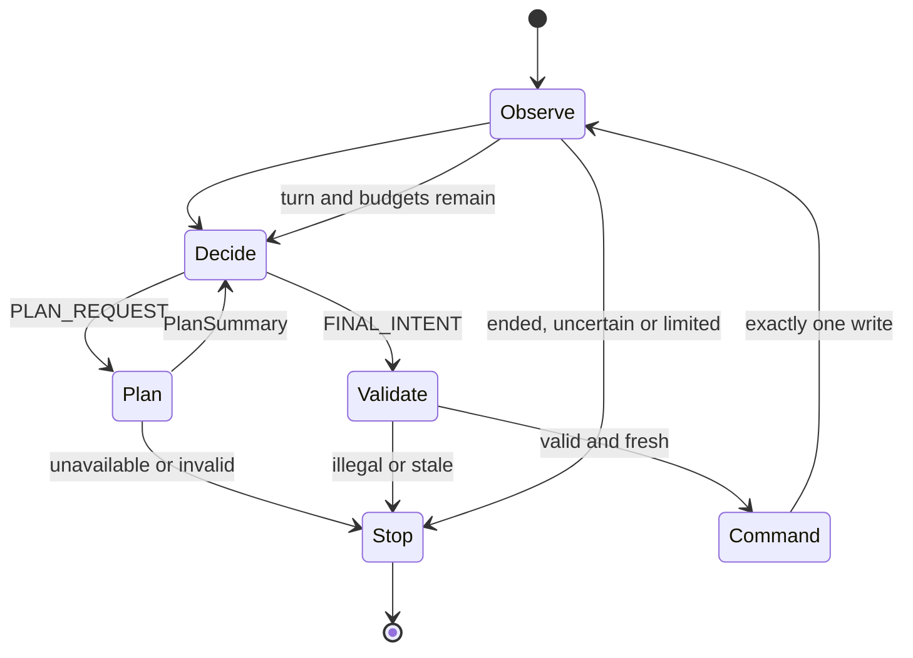

# Working token-control architecture

Status: **PROPOSED production architecture based on pinned donor source and existing live evidence.** Execution is not claimed as implemented. Runtime remains Foundry 12.343, D&D5e 3.3.1 and Midi-QOL.

## 1. Architecture decision

The working version is a small orchestrator around Foundry documents and native Item execution, not another D&D rules engine.



The LLM chooses only offered capability, target and movement references. Deterministic code resolves fresh IDs, validates and dispatches. D&D5e/Midi perform rolls, saves, damage, healing, resource consumption and effects. Every write gets a fresh readback. Ambiguous writes are observed and stopped, never retried automatically.

## 2. Donor harvest

| Need | Exact donor evidence | Production choice |
|---|---|---|
| Transport and command bus | `_references/foundry-api-bridge/src/transport/WebSocketClient.ts`, `src/commands/CommandRouter.ts`, `src/main.ts` | Keep Bridge and its request IDs. |
| Generic D&D5e execution | `foundry-api-bridge/src/systems/dnd5e/item-actions/application/Dnd5eItemActivationService.ts`; `infrastructure/Dnd5eItemActivationGateway.ts::activate` calls legacy `item.use(config)` | One seam for weapons, spells, features and usable Items; no per-spell handlers. |
| Targets and Midi | `Dnd5eTargetingGateway.ts`, `Dnd5eMidiWorkflowGateway.ts` | Reuse boundary, but add target restoration and invocation-scoped workflow matching. Current unscoped `Hooks.once('midi-qol.RollComplete')` is unsafe. |
| System projection | `_references/foundry-ai-tool/packages/mcp-server/src/systems/types.ts::SystemAdapter`, `systems/dnd5e/adapter.ts`, `packages/foundry-module/src/data-access/actor-builder.ts` | Adopt compact system adapters, not broad MCP tools or name matching. |
| Turn lifecycle | `_references/mookAI-12/scripts/mook.js::startTurn/sense/planTurn/act`, serialized runner in `mookAI.js` | Reuse lifecycle shape only; reject hardcoded tactics and recursive planning. |
| V12 paths | `_references/lib-find-the-path-12/scripts/pathManager.js::Path.findPath`, `utility.js::FTPUtility.traverse` | Harvest edge cases. Use Bridge `commands/handlers/token/GridPathfinder.ts::findGridPath` as the sole route engine. |
| LLM exchange | `_references/foundry-ai` OpenRouter tool loop | Structured continuation with hard response, repair, plan and time limits. |
| Spell coverage | `analysis/laaru-spells-mechanical.json`, `LAARU_SPELL_COMPENDIUM_AUDIT.md` | Offline samples only; live Actor-owned Items are authoritative. |
| Spell execution | `V12_SPELL_EXECUTION_DONOR_AUDIT.md`, ThreeHats legacy `Item.use()` | Spells use the same Item seam. Invokable does not mean fully automated. |

PF2e AI Combat Assistant and unlicensed donors remain architecture-only. `_references/` stays read-only.

## 3. Identity and control

The current linked-Actor restriction is the wrong production boundary; the live Mage is unlinked. Resolve the effective Actor through the scene token:

```text
sceneId + tokenId
  -> scene.tokens.get(tokenId)
  -> tokenDocument.actor
  -> effective Actor and current owned Items
```

This supports linked and synthetic tokens and disambiguates multiple instances of one base Actor.

- `actorId`: stable narrative/base identity when available.
- `sceneId + tokenId`: authoritative execution scope.
- `itemId`: Item owned by that token's effective Actor, never a Compendium ID.
- `combatId + combatantId + turnRevision`: stale-turn guard.
- `snapshotId`: exact observed state offered to the model.

Control ownership comes only from effective Actor `hasPlayerOwner`; player-owned Actors are never AI controlled. Foundry disposition, combat opposition and StoryCore relationship are separate facts. Bridge must resolve the token Actor again immediately before execution.

## 4. Universal ActionCapability

A capability is a compact structural projection of an Actor-owned Item. It explains choices without resolving rules.

```ts
interface ActionCapability {
  capabilityId: string;
  itemId: string;
  name: string;
  itemType: "weapon" | "spell" | "feat" | "consumable" | "equipment" | "other";
  legacy: boolean;
  activation: { type: string | null; cost: number | null; condition: string | null };
  targeting: {
    mode: "self" | "creature" | "point" | "area" | "none" | "unknown";
    count: number | null;
    rangeValue: number | null;
    longRangeValue: number | null;
    units: string | null;
    area: { type: string; value: number | null; units: string | null } | null;
  };
  resolution: {
    kind: "attack" | "save" | "healing" | "utility" | "mixed" | "unknown";
    actionType: string | null;
    saveAbility: string | null;
    damageParts: readonly { formula: string; damageType: string | null }[];
    healingParts: readonly { formula: string; healingType: string | null }[];
  };
  availability: {
    usable: true | false | "unknown";
    equipped: boolean | null;
    prepared: boolean | null;
    quantity: number | null;
    uses: { value: number | null; max: number | null; per: string | null } | null;
    consume: { type: string | null; target: string | null; amount: number | null } | null;
    offeredCastLevels: readonly number[];
    blockers: readonly string[];
  };
  traits: { concentration: boolean | null; ritual: boolean | null; effectsCount: number };
  automation: {
    execution: "supported" | "supervised" | "unsupported" | "unknown";
    resolver: "dnd5e" | "midi" | "dnd5e+midi" | "manual" | "unknown";
  };
  tacticalSummary: string | null;
}
```

Project by `item.type` and field shape, never by Item name:

- `LegacyWeaponProjector`: melee/ranged range, equip state, ammunition and uses.
- `LegacySpellProjector`: attack/save/heal/utility, level/preparation, range, target, area, uses and concentration.
- `LegacyFeatureProjector`: monster/class/race features, recharge/uses, activation, target, damage and save.
- `ConsumableProjector`: quantity, uses and consumption.
- `UnsupportedItemProjector`: explicit reason instead of silent omission.

Skills and abilities are separate context-gated `CheckCapability` entries backed by Bridge `dnd5e/roll-skill`, `roll-ability` and `roll-save`. Missing fields remain unknown. Bounded sanitized descriptions or cached summaries may explain homebrew Items to the LLM, but never become rules or identity.

## 5. Full internal state and compact DecisionView

The runtime retains complete trusted state. The LLM receives turn/self facts, perceived actors, relationships, conditions, offered capabilities, offered path plans and bounded narrative context. It never receives raw Actor dumps, flags, HTML or Compendiums. If relevant Items do not fit, stop with `DECISION_VIEW_INCOMPLETE`; code cannot select from a truncated subset as a tactical fallback.

## 6. Bounded turn episode



Bounds for the first working version: one NPC episode; at most four accepted writes; two plan requests, two repairs and five LLM responses per decision; current 60-second decision/snapshot lifetime; at most eight decisions and 120 seconds per episode; no retry after dispatch; `PLANNING_UNAVAILABLE` stops immediately.

Fresh OBSERVE after movement creates a new decision. The LLM may choose move, then activate Item, then end turn. Code never substitutes tactics such as “too far, use bow.”

## 7. Intent contract

A response is exactly one of:

1. `PLAN_REQUEST`: semantic approach/retreat/position goal; no waypoints.
2. `FINAL_INTENT.activate_item`: offered capability, permitted targets and only an offered cast level.
3. `FINAL_INTENT.move`: offered, unexpired `planId`.
4. `FINAL_INTENT.end_turn`.

Validator rechecks current turn, snapshot age, scene/combat/token scope, player ownership, effective Actor-owned Item, target visibility, range/resources/action economy when known and offered references. Required unknown legality rejects or stays supervised; it is never guessed.

## 8. Minimal Bridge extensions

Keep API Bridge as the sole command bus. Implement these in a maintained fork/extension, never in `_references/`.

- **`get-token-actor-context` read:** input `sceneId + tokenId`; return bounded effective Actor identity, `hasPlayerOwner`, resources, effects and owned Item mechanics. This unlocks synthetic Actors and duplicate base-Actor instances.
- **`plan-token-path` read:** call the same Bridge `findGridPath` used by movement; return `planId`, start/end, cost, path hash, expiry, resulting range/LOS and scope fingerprint; do not move.
- **Scoped planned movement write:** accept only valid `planId`, explicit scope and expected start; revalidate path/budget, move once and fresh-read.
- **Scoped `dnd5e/activate-item` write:** include scene, acting token, combat/turn expectations, scope fingerprint and invocation ID. Resolve `scene.tokens.get(tokenId).actor.items.get(itemId)` at dispatch. Preserve legacy `item.use()`; later upcasting maps legacy `slotLevel`.
- **Guarded `next-turn` write:** require expected combatant/round/turn, advance once and observe.

Item activation saves user targets, clears them, sets exact validated targets, arms scoped observation, invokes, fresh-reads and restores targets in `finally` when safe. Match workflow using invocation window, actor, acting token, item, expected targets and workflow/chat evidence. Ambiguity returns `WORKFLOW_CORRELATION_UNCERTAIN` with no retry.

## 9. Authority boundary

| Responsibility | Owner |
|---|---|
| Personality, relationships and tactics | StoryCore + LLM |
| Identity and discovery | Adapter + scoped Bridge reads |
| Capability compression | D&D5e V3 legacy projectors |
| Geometry/path cost | Bridge/Foundry |
| Reference, legality and staleness validation | Adapter |
| Attack/save/damage/healing/resistance/HP | D&D5e + Midi |
| Slots, charges and uses | D&D5e Item use, with Midi where configured |
| Concentration/effects | D&D5e/Midi/DAE as configured; unknown automation is explicit |
| Outcome truth | Fresh Foundry reads plus correlated workflow evidence |

StoryCore never applies damage, decrements slots, synthesizes hits, duplicates effects or sends arbitrary JavaScript.

## 10. First working scope

Support one non-player-owned current combatant; linked or unlinked 1x1 token; all structurally understood legacy weapons, spells, features and consumables; single-target attack/save/heal and self/no-target Items when automation is observable; wall-aware square-grid walking; explicit end turn; fresh OBSERVE after every write.

Defer AoE/templates, reactions, doors, difficult terrain, flying/elevation, summons, blocking configuration choices, complex bonus-action/multiattack orchestration and coordinated multi-NPC tactics. Unsupported Items remain visible with reasons.

## 11. Exact production modules

| Module | Responsibility |
|---|---|
| `src/domain/action-capability.ts` | Capability and availability types. |
| `src/domain/decision-view.ts` | Compact model DTO. |
| `src/systems/system-adapter.ts` | Small system registry/port. |
| `src/systems/dnd5e-v3/legacy-item-projector.ts` | Structural Item projectors. |
| `src/systems/dnd5e-v3/check-projector.ts` | Context-gated checks. |
| `src/combat-sensor.ts` | Switch Actor detail to token-scoped context. |
| `src/combat-normalizer.ts` | Build trusted state; remove weapon-only filter. |
| `src/decision-view-builder.ts` | Visibility/relevance/size bounds. |
| `src/intent-validator.ts` | Fresh reference/state/support validation. |
| `src/command-compiler.ts` | Small Bridge command allowlist. |
| `src/outcome-observer.ts` | Correlated evidence and readback. |
| `src/turn-orchestrator.ts` | Serialized bounded turn episode. |
| `src/decision-runner.ts` | One decision; stop on unavailable planning. |
| maintained Bridge extension | Token Actor read, paths, scoped Item use and guarded turn advance. |

The Fire Bolt harness remains diagnostic; it is not a special production path.

## 12. Shortest implementation sequence

1. Add token-scoped effective Actor read with linked/unlinked/player-ownership fixtures. No writes.
2. Build universal capability projection and offline coverage across real fixtures plus LAARU samples. No name handlers.
3. Add compact DecisionView and fail-closed size policy.
4. Stop the current loop on `PLANNING_UNAVAILABLE`.
5. Harden scoped Item activation, target lifecycle and workflow correlation; supervise one weapon and one simple owned cantrip once each.
6. Add Bridge path preview and planned movement using one pathfinder.
7. Add bounded turn orchestration across fresh snapshots.
8. Expand by structural family: save, heal, self feature and resource-bound feature.

## 13. Acceptance

A version is working when a non-player-owned linked or unlinked current token is discovered without manual IDs; every usable Actor-owned legacy Item is represented or explicitly unsupported; the real LLM chooses offered action/target/movement references; deterministic code rejects stale or illegal intent; Bridge invokes the effective Actor-owned Item or path; D&D5e/Midi resolve rules; fresh state confirms the outcome; and ambiguity or hard limits stop safely.

Do not repeat established POCs. New tests target only new seams: synthetic Actor reads, capability coverage, workflow correlation, planned movement authorization and bounded orchestration.
